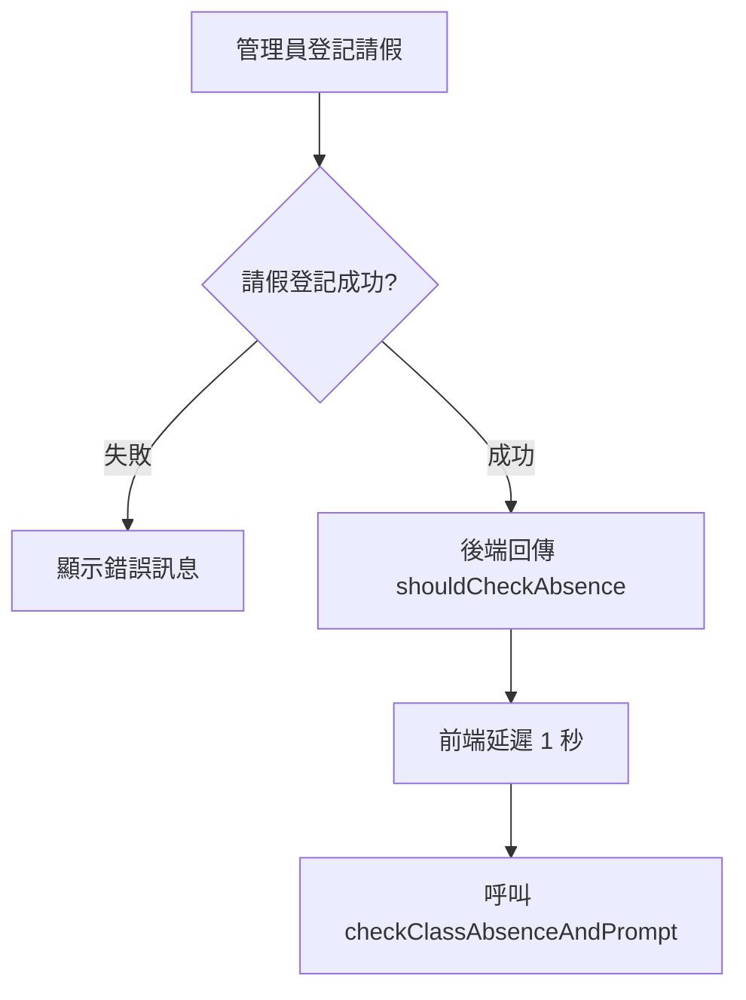
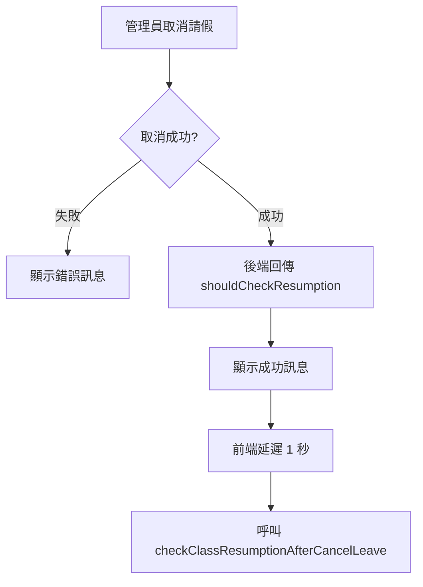
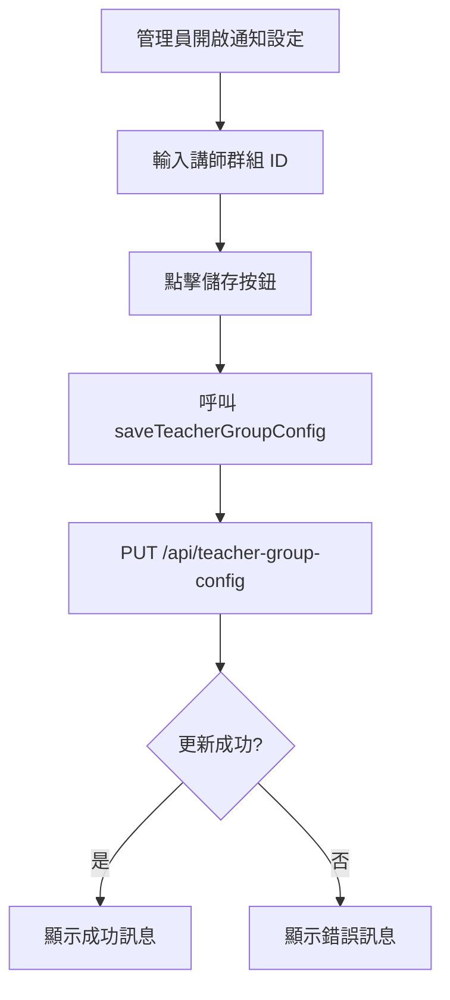

# 全班缺席自動通知系統 - 程式邏輯流程圖

## 🎯 系統架構總覽

```
┌─────────────────────────────────────────────────────────────┐
│                   FLB 全班缺席通知系統                        │
├─────────────────────────────────────────────────────────────┤
│                                                               │
│  前端 (admin-dashboard.html)                                  │
│  ├─ 請假登記介面                                              │
│  ├─ 請假記錄管理                                              │
│  ├─ 講師群組設定介面                                          │
│  └─ 通知觸發邏輯                                              │
│                                                               │
│  後端 (server.js)                                             │
│  ├─ API 端點                                                  │
│  ├─ 通知發送邏輯                                              │
│  ├─ 全班缺席檢查                                              │
│  └─ Flex Message 處理                                         │
│                                                               │
│  配置檔案                                                     │
│  ├─ notification-config.json (群組設定)                       │
│  ├─ flex-message-templates.json (訊息模板)                    │
│  └─ teacher_data.json (講師資料)                              │
│                                                               │
└─────────────────────────────────────────────────────────────┘
```

---

## 📊 流程 1：全班缺席停課通知

### 1.1 請假登記觸發



**程式碼位置**：
- 觸發：`admin-dashboard.html` Line 11891-11897
```javascript
if (result.shouldCheckAbsence && result.leaveInfo) {
    setTimeout(() => {
        checkClassAbsenceAndPrompt(result.leaveInfo);
    }, 1000);
}
```

---

### 1.2 全班缺席檢查流程

```
┌──────────────────────────────────────────────────────────────┐
│ checkClassAbsenceAndPrompt()                                  │
├──────────────────────────────────────────────────────────────┤
│                                                                │
│ 1. 依日期和課程分組 leaveInfo                                 │
│    groupedByDateCourse = {                                     │
│        "2025-01-15_SPM": {                                     │
│            date: "2025-01-15",                                 │
│            courseType: "SPM",                                  │
│            students: ["學生A", "學生B", ...]                   │
│        }                                                       │
│    }                                                           │
│                                                                │
│ 2. 逐個檢查每個日期+課程組合                                   │
│    ┌────────────────────────────────────────┐                │
│    │ for each (date, courseType)            │                │
│    │                                          │                │
│    │ → POST /api/check-class-absence        │                │
│    │   { courseType, date }                 │                │
│    │                                          │                │
│    │ ← { success, allAbsent, totalStudents, │                │
│    │     absentStudents, students }         │                │
│    └────────────────────────────────────────┘                │
│                                                                │
│ 3. 如果 allAbsent === true                                    │
│    ┌────────────────────────────────────────┐                │
│    │ 🔥 立即發送停課通知                     │                │
│    │                                          │                │
│    │ a) 查詢事件資料                         │                │
│    │    GET /api/events                      │                │
│    │                                          │                │
│    │ b) 找到匹配的事件                       │                │
│    │    - 比對日期                           │                │
│    │    - 比對課程名稱                       │                │
│    │                                          │                │
│    │ c) 提取講師名稱和時間                   │                │
│    │    title.split('-') → teacherName       │                │
│    │    format startTime/endTime             │                │
│    │                                          │                │
│    │ d) 發送通知                             │                │
│    │    POST /api/notify-class-cancellation  │                │
│    │    {                                     │                │
│    │        eventId, date, courseType,       │                │
│    │        teacherName, totalStudents, time │                │
│    │    }                                     │                │
│    └────────────────────────────────────────┘                │
│                                                                │
│ 4. 顯示停課確認對話框                                         │
│    showStopClassConfirmModal(info)                            │
│                                                                │
│ 5. 只處理第一個全班缺席的情況                                 │
│    break                                                       │
│                                                                │
└──────────────────────────────────────────────────────────────┘
```

**程式碼位置**：`admin-dashboard.html` Line 12400-12507

---

### 1.3 後端檢查邏輯

```
┌──────────────────────────────────────────────────────────────┐
│ POST /api/check-class-absence                                 │
├──────────────────────────────────────────────────────────────┤
│                                                                │
│ 輸入：{ courseType, period?, date }                           │
│                                                                │
│ 1. 載入學生資料                                               │
│    ├─ student_data.json (正式學生)                            │
│    └─ temporary_students.json (臨時學生)                      │
│                                                                │
│ 2. 篩選該課程的學生                                           │
│    classStudents = students.filter(s =>                       │
│        s.courseType === courseType &&                          │
│        (period ? s.period === period : true)                   │
│    )                                                           │
│                                                                │
│ 3. 檢查每位學生的出缺席狀態                                   │
│    studentsStatus = classStudents.map(student => {            │
│        const record = student.attendance.find(r =>            │
│            r.date === date                                     │
│        );                                                      │
│                                                                │
│        if (record.present === true)                            │
│            return { name, status: 'present' }                 │
│        else if (record.present === 'leave')                    │
│            return { name, status: 'leave' }                   │
│        else if (record.present === false)                      │
│            return { name, status: 'absent' }                  │
│        else                                                    │
│            return { name, status: 'unknown' }                 │
│    })                                                          │
│                                                                │
│ 4. 判斷是否全班缺席                                           │
│    absentCount = studentsStatus.filter(s =>                   │
│        s.status === 'leave' || s.status === 'absent'          │
│    ).length                                                    │
│                                                                │
│    allAbsent = (absentCount === classStudents.length) &&      │
│                 (classStudents.length > 0)                     │
│                                                                │
│ 5. 回傳結果                                                   │
│    {                                                           │
│        success: true,                                          │
│        allAbsent: allAbsent,                                   │
│        totalStudents: classStudents.length,                    │
│        absentStudents: absentCount,                            │
│        students: studentsStatus,                               │
│        courseType, period, date                                │
│    }                                                           │
│                                                                │
└──────────────────────────────────────────────────────────────┘
```

**程式碼位置**：`server.js` Line 5546-5658

---

### 1.4 發送停課通知流程

```
┌──────────────────────────────────────────────────────────────┐
│ POST /api/notify-class-cancellation                           │
├──────────────────────────────────────────────────────────────┤
│                                                                │
│ 輸入：{ eventId, date, courseType, teacherName,              │
│         totalStudents, time }                                  │
│                                                                │
│ 1. 載入 Flex Message 模板                                     │
│    flexTemplates = JSON.parse(                                │
│        fs.readFileSync('flex-message-templates.json')          │
│    )                                                           │
│    templateData = flexTemplates.templates.class_cancelled     │
│                                                                │
│ 2. 替換模板變數                                               │
│    replacements = {                                            │
│        '{teacherName}': teacherName,                           │
│        '{courseName}': courseType,                             │
│        '{date}': date,                                         │
│        '{time}': time,                                         │
│        '{totalStudents}': totalStudents                        │
│    }                                                           │
│                                                                │
│    遞迴替換所有字串中的變數                                   │
│    replaceInObject(flexMessage)                               │
│                                                                │
│ 3. 讀取通知配置                                               │
│    notifConfig = JSON.parse(                                  │
│        fs.readFileSync('notification-config.json')             │
│    )                                                           │
│                                                                │
│    teacherGroupId = notifConfig.roles.teacher_group.group_id  │
│    staffGroupId = notifConfig.roles.admin.group_id            │
│                                                                │
│ 4. 發送通知到三個目標                                         │
│    ┌──────────────────────────────────────────┐              │
│    │ Target 1: 講師個人                        │              │
│    │ ─────────────────────────────             │              │
│    │ teacherUserId = getTeacherUserId(         │              │
│    │     teacherName                            │              │
│    │ )                                          │              │
│    │                                            │              │
│    │ if (teacherUserId) {                       │              │
│    │     await notificationManager              │              │
│    │         .sendLineMessage(                  │              │
│    │             teacherUserId,                 │              │
│    │             '',                             │              │
│    │             {                               │              │
│    │                 type: 'flex',              │              │
│    │                 altText: '⚠️ 全班缺席停課通知', │       │
│    │                 contents: flexMessage      │              │
│    │             }                               │              │
│    │         )                                   │              │
│    │ } else {                                    │              │
│    │     console.log('⚠️ 找不到講師 userId')     │              │
│    │ }                                           │              │
│    └──────────────────────────────────────────┘              │
│                                                                │
│    ┌──────────────────────────────────────────┐              │
│    │ Target 2: 講師群組                        │              │
│    │ ─────────────────────────────             │              │
│    │ if (teacherGroupId) {                      │              │
│    │     await notificationManager              │              │
│    │         .sendLineMessage(                  │              │
│    │             teacherGroupId,                │              │
│    │             '',                             │              │
│    │             { type: 'flex', ... }          │              │
│    │         )                                   │              │
│    │ }                                           │              │
│    └──────────────────────────────────────────┘              │
│                                                                │
│    ┌──────────────────────────────────────────┐              │
│    │ Target 3: 正職群組                        │              │
│    │ ─────────────────────────────             │              │
│    │ if (staffGroupId) {                        │              │
│    │     await notificationManager              │              │
│    │         .sendLineMessage(                  │              │
│    │             staffGroupId,                  │              │
│    │             '',                             │              │
│    │             { type: 'flex', ... }          │              │
│    │         )                                   │              │
│    │ }                                           │              │
│    └──────────────────────────────────────────┘              │
│                                                                │
│ 5. 回傳結果                                                   │
│    successCount = results.filter(r => r.success).length      │
│                                                                │
│    {                                                           │
│        success: successCount > 0,                              │
│        message: `通知已發送 (${successCount}/3 成功)`,        │
│        results: [                                              │
│            { target: '講師個人', success, ... },               │
│            { target: '講師群組', success, ... },               │
│            { target: '正職群組', success, ... }                │
│        ]                                                       │
│    }                                                           │
│                                                                │
└──────────────────────────────────────────────────────────────┘
```

**程式碼位置**：`server.js` Line 5665-5799

---

## 📊 流程 2：取消請假恢復上課通知

### 2.1 取消請假觸發



**程式碼位置**：
- 前端觸發：`admin-dashboard.html` Line 12336-12343
```javascript
if (result.shouldCheckResumption && result.courseInfo) {
    setTimeout(() => {
        checkClassResumptionAfterCancelLeave(result.courseInfo);
    }, 1000);
}
```

- 後端回傳：`server.js` Line 5440-5451
```javascript
res.json({
    success: true,
    message: '請假已取消',
    data: cancelResult.data,
    shouldCheckResumption: true,  // 🔥 旗標
    courseInfo: {
        date, courseType, studentName
    }
});
```

---

### 2.2 恢復上課檢查流程

```
┌──────────────────────────────────────────────────────────────┐
│ checkClassResumptionAfterCancelLeave(courseInfo)              │
├──────────────────────────────────────────────────────────────┤
│                                                                │
│ 輸入：{ date, courseType, studentName }                       │
│                                                                │
│ 1. 檢查當前班級缺席狀態                                       │
│    POST /api/check-class-absence                              │
│    { courseType, date }                                        │
│                                                                │
│    ← { success, allAbsent, totalStudents, students }         │
│                                                                │
│ 2. 判斷是否恢復上課                                           │
│    if (!allAbsent) {                                           │
│        // 從全班缺席變成有人出席                              │
│                                                                │
│        // 計算出席人數                                        │
│        attendCount = students.filter(s =>                     │
│            s.status === 'present' ||                           │
│            s.status === 'unknown'                              │
│        ).length                                                │
│                                                                │
│        if (attendCount > 0) {                                  │
│            ┌────────────────────────────────────┐            │
│            │ 🔥 發送恢復上課通知                 │            │
│            │                                      │            │
│            │ a) 查詢事件資料                     │            │
│            │    GET /api/events                  │            │
│            │                                      │            │
│            │ b) 找到匹配的事件                   │            │
│            │    - 比對日期                       │            │
│            │    - 比對課程名稱                   │            │
│            │                                      │            │
│            │ c) 提取講師名稱和時間               │            │
│            │    title.split('-') → teacherName   │            │
│            │    format startTime/endTime         │            │
│            │                                      │            │
│            │ d) 發送通知                         │            │
│            │    POST /api/notify-class-resumption│            │
│            │    {                                 │            │
│            │        eventId, date, courseType,   │            │
│            │        teacherName, studentName,    │            │
│            │        attendCount, totalStudents,  │            │
│            │        time                          │            │
│            │    }                                 │            │
│            └────────────────────────────────────┘            │
│        }                                                       │
│    } else {                                                    │
│        console.log('⚠️ 仍然全班缺席')                          │
│    }                                                           │
│                                                                │
└──────────────────────────────────────────────────────────────┘
```

**程式碼位置**：`admin-dashboard.html` Line 12514-12603

---

### 2.3 發送恢復上課通知流程

```
┌──────────────────────────────────────────────────────────────┐
│ POST /api/notify-class-resumption                             │
├──────────────────────────────────────────────────────────────┤
│                                                                │
│ 輸入：{ eventId, date, courseType, teacherName,              │
│         studentName, attendCount, totalStudents, time }        │
│                                                                │
│ 流程與停課通知類似，差異點：                                  │
│                                                                │
│ 1. 使用不同的模板                                             │
│    templateData = flexTemplates.templates.class_resumed       │
│                                                                │
│ 2. 替換變數包含取消請假的學生                                │
│    replacements = {                                            │
│        '{teacherName}': teacherName,                           │
│        '{courseName}': courseType,                             │
│        '{date}': date,                                         │
│        '{time}': time,                                         │
│        '{studentName}': studentName,      // 🔥 新增          │
│        '{attendCount}': attendCount,      // 🔥 新增          │
│        '{totalStudents}': totalStudents                        │
│    }                                                           │
│                                                                │
│ 3. 發送到相同的三個目標                                       │
│    - 講師個人                                                 │
│    - 講師群組                                                 │
│    - 正職群組                                                 │
│                                                                │
│ 4. 使用綠色主題（#28a745）                                    │
│    altText: '✅ 課程恢復上課通知'                              │
│                                                                │
└──────────────────────────────────────────────────────────────┘
```

**程式碼位置**：`server.js` Line 5804-5940

---

## 📊 流程 3：講師群組設定

### 3.1 設定流程



### 3.2 後端處理

```
┌──────────────────────────────────────────────────────────────┐
│ PUT /api/teacher-group-config                                 │
├──────────────────────────────────────────────────────────────┤
│                                                                │
│ 輸入：{ group_id }                                            │
│                                                                │
│ 1. 驗證輸入                                                   │
│    if (!group_id || typeof group_id !== 'string')             │
│        return error                                            │
│                                                                │
│ 2. 讀取現有配置                                               │
│    config = JSON.parse(                                       │
│        fs.readFileSync('notification-config.json')            │
│    )                                                           │
│                                                                │
│ 3. 確保結構存在                                               │
│    if (!config.roles) config.roles = {}                       │
│    if (!config.roles.teacher_group) {                         │
│        config.roles.teacher_group = {                         │
│            name: '講師群組',                                  │
│            description: '...',                                 │
│            permissions: [...]                                  │
│        }                                                       │
│    }                                                           │
│                                                                │
│ 4. 更新 group_id                                              │
│    config.roles.teacher_group.group_id = group_id.trim()      │
│                                                                │
│ 5. 寫回檔案                                                   │
│    fs.writeFileSync(                                          │
│        'notification-config.json',                            │
│        JSON.stringify(config, null, 2)                        │
│    )                                                           │
│                                                                │
│ 6. 回傳結果                                                   │
│    {                                                           │
│        success: true,                                          │
│        message: '講師群組設定已更新',                         │
│        data: { group_id }                                      │
│    }                                                           │
│                                                                │
└──────────────────────────────────────────────────────────────┘
```

**程式碼位置**：`server.js` Line 4859-4918

---

## 🔧 輔助函數

### extractTeacherNameFromTitle()

```javascript
// 從事件標題提取講師名稱
// 支援多種格式

function extractTeacherNameFromTitle(title) {
    if (!title) return null;
    
    // 模式 1: "課程 - 講師名稱" 或 "講師名稱 - 課程"
    const pattern1 = /[-–—]\s*([A-Za-z\u4e00-\u9fa5]+(?:\s+[A-Za-z\u4e00-\u9fa5]+)?)\s*(?:老師|講師)?$/;
    const pattern2 = /^([A-Za-z\u4e00-\u9fa5]+(?:\s+[A-Za-z\u4e00-\u9fa5]+)?)\s*(?:老師|講師)?\s*[-–—]/;
    
    // 模式 3: 直接包含 "XX老師" 或 "XX講師"
    const pattern3 = /([A-Za-z\u4e00-\u9fa5]+)\s*(?:老師|講師)/;
    
    let match = title.match(pattern1) || 
                title.match(pattern2) || 
                title.match(pattern3);
    
    if (match && match[1]) {
        let teacherName = match[1].trim();
        teacherName = teacherName.replace(/(?:老師|講師)$/, '').trim();
        return teacherName;
    }
    
    return null;
}
```

**測試案例**：
```javascript
extractTeacherNameFromTitle("SPM - TED")         // → "TED"
extractTeacherNameFromTitle("TED - SPM")         // → "TED"
extractTeacherNameFromTitle("SPM TED老師")      // → "TED"
extractTeacherNameFromTitle("TED講師 - SPM")    // → "TED"
```

---

### getTeacherUserId()

```javascript
// 從 teacher_data.json 查找講師 userId

function getTeacherUserId(teacherName) {
    if (!teacherName) return null;
    
    try {
        const teacherData = JSON.parse(
            fs.readFileSync('teacher_data.json', 'utf8')
        );
        const teachers = teacherData.teachers || [];
        
        // 不區分大小寫比對
        const normalizedName = teacherName.toUpperCase().trim();
        const teacher = teachers.find(t => 
            t.name && 
            t.name.toUpperCase().trim() === normalizedName
        );
        
        if (teacher && teacher.userId) {
            return teacher.userId;
        }
        
        console.log(`⚠️ 找不到講師 ${teacherName} 的 userId`);
        return null;
        
    } catch (error) {
        console.error(`❌ 讀取講師資料失敗:`, error);
        return null;
    }
}
```

**行為**：
- ✅ 不區分大小寫（"TED" === "ted" === "Ted"）
- ✅ 自動 trim 空白
- ⚠️ 找不到返回 null，但不中斷流程
- ✅ 系統仍會發送到群組

---

## 🔄 資料流向圖

```
請假登記
    ↓
student_data.json 更新
    ↓
前端觸發檢查
    ↓
後端驗證全班缺席
    ↓
├─→ 查詢 teacher_data.json (講師 userId)
├─→ 讀取 notification-config.json (群組 ID)
├─→ 載入 flex-message-templates.json (訊息模板)
│
↓
發送 LINE 通知
    ├─→ 講師個人
    ├─→ 講師群組
    └─→ 正職群組
    
前端顯示確認對話框
```

---

## ⚠️ 錯誤處理機制

### 1. 找不到講師 userId
```
預期行為：
✓ 記錄警告日誌
✓ 繼續發送到講師群組和正職群組
✓ 不中斷流程
```

### 2. 群組 ID 未設定
```
預期行為：
✓ 記錄警告日誌
✓ 跳過該群組
✓ 繼續處理其他目標
```

### 3. LINE API 錯誤
```
預期行為：
✓ 捕獲錯誤並記錄
✓ 將錯誤加入 results
✓ 不影響其他通知發送
```

### 4. 找不到事件
```
預期行為：
✓ 記錄警告日誌
✓ 無法發送通知
✓ 前端顯示友善錯誤訊息
```

---

## 📝 關鍵決策點

### 1. 為何在顯示對話框前發送通知？
**原因**：確保通知立即發送，不等待用戶手動確認

### 2. 為何延遲 1 秒執行檢查？
**原因**：確保 Google Sheets 和資料庫更新完成

### 3. 為何只處理第一個全班缺席？
**原因**：避免彈出多個對話框造成困擾

### 4. 為何找不到 userId 仍繼續？
**原因**：容錯設計，確保至少群組能收到通知

---

## 🎯 效能考量

1. **批次發送**：同時發送到三個目標，不等待前一個完成
2. **錯誤隔離**：一個目標失敗不影響其他目標
3. **快取優化**：事件資料僅查詢一次
4. **非阻塞**：通知發送不阻塞主流程

---

**文檔版本**: 1.0  
**更新日期**: 2025-11-06  
**系統版本**: v2.4


